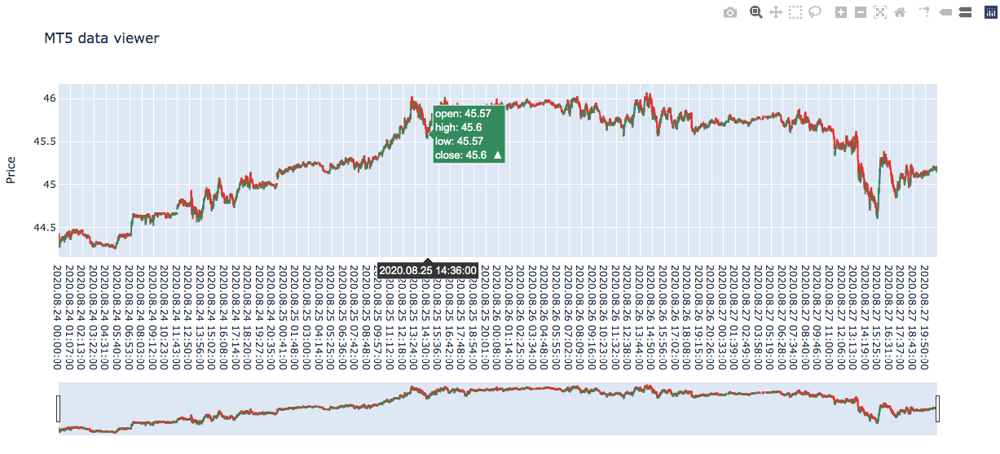
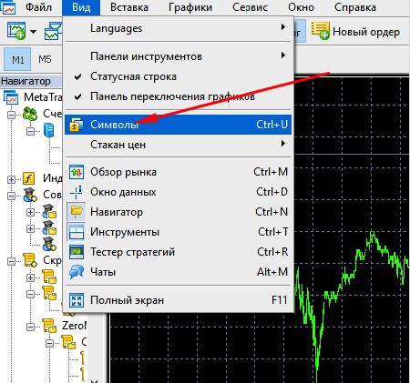
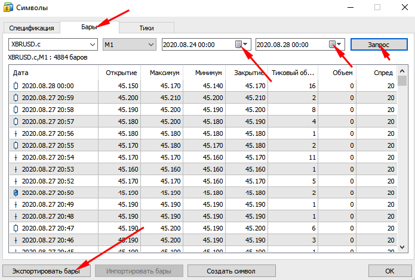

# mt5_dataviewer
Python/Plotly data viewer for MT5 exported data

This script make a candlestick chart in Plotly library to visualize a bar data from MetaTrader 5 export.

in 24-28.csv an example data exported from my MT5

## How to export from MT5
Step 1:

Step 2:

